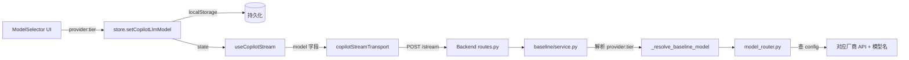

## 用户需求

在 Copilot 聊天界面实现多模型选择器，支持三个大模型厂商，每个厂商可选 Balanced / Advanced 两档：

| Provider | Balanced | Advanced |
| --- | --- | --- |
| DeepSeek | `deepseek-chat` | `deepseek-reasoner` |
| 通义千问 | `qwen-plus` | `qwen-max` |
| 文心一言 | `ernie-speed-128k` | `ernie-4.0-turbo-128k` |


## 产品概述

将当前的二元模型切换（Standard ↔ Advanced）改为「厂商 + 档位」双维度选择器。用户在输入框底部看到一个下拉按钮，点击后弹出面板：左侧选择厂商（DeepSeek / 通义千问 / 文心一言），右侧切换档位（Balanced / Advanced），选择立即生效并持久化到 localStorage。

## 核心功能

- 厂商选择：3 个中文名称的图标按钮选中态高亮
- 档位切换：同一厂商下 Balanced ↔ Advanced 即时切换
- 选择持久化：刷新页面保持上一次选择
- 传输协议：前端发送 `"deepseek:advanced"` 复合字符串 → 后端解析为「哪个厂商 API + 哪个模型名」并路由

## 技术栈

- 前端：React + TypeScript + Zustand + Tailwind CSS
- 后端：Python + FastAPI + Pydantic Settings + LangfuseAsyncOpenAI
- 通信：复合模型字符串 `"provider:tier"`

## 实现方案

### 数据流



### 前端方案

**store.ts**: `CopilotLlmModel` 类型改为 `"deepseek:standard" | "deepseek:advanced" | "qwen:standard" | "qwen:advanced" | "ernie:standard" | "ernie:advanced"`。默认值 `"deepseek:standard"`。`setCopilotLlmModel` 验证值合法性后持久化。

**ModelSelector.tsx**（替换 ModelToggleButton.tsx）：使用 Popover 弹出面板。面板内部分两行：

- 第一行：3 个厂商按钮（DeepSeek / 通义千问 / 文心一言），选中态用蓝色填充 + 白色文字
- 第二行：档位切换滑块（Balanced ↔ Advanced），切换时保持当前厂商不变

**ChatInput.tsx**: `handleToggleModel` 改为 `handleSelectModel(provider, tier)`。ModelToggleButton 替换为 ModelSelector。Feature flag `CHAT_MODE_OPTION` 仍控制整体显隐。

### 后端方案

**config.py**: 新增 4×2 = 8 个模型字段：

- `qwen_standard_model`（默认 `qwen-plus`）、`qwen_advanced_model`（默认 `qwen-max`）
- `ernie_standard_model`（默认 `ernie-speed-128k`）、`ernie_advanced_model`（默认 `ernie-4.0-turbo-128k`）
- 对应环境变量：`CHAT_QWEN_STANDARD_MODEL`、`CHAT_QWEN_ADVANCED_MODEL`、`CHAT_ERNIE_STANDARD_MODEL`、`CHAT_ERNIE_ADVANCED_MODEL`

新增厂商凭证字段：`qwen_api_key`（→ `DASHSCOPE_API_KEY`）、`qwen_base_url`（→ `https://dashscope.aliyuncs.com/compatible-mode/v1`）、`ernie_api_key`（→ `QIANFAN_API_KEY`）、`ernie_base_url`（→ `https://qianfan.baidubce.com/v2`）

**service.py**: `_get_main_client()` 改为 `_get_main_client(provider: str)`。使用 `dict` 缓存多厂商客户端（key=provider, value=LangfuseAsyncOpenAI），首次请求时按厂商创建不同凭证的客户端。

**model_router.py**: `_config_default()` 新增 `provider` 参数，根据 provider+tier 从 config 读取对应模型名。

**baseline/service.py**: `_resolve_baseline_model()` 解析复合字符串（split `":"`），分别传给 model_router。

## 目录结构

```
frontend/src/app/(platform)/copilot/
├── store.ts                                    # [MODIFY] CopilotLlmModel 类型 + 默认值 + 验证
├── components/ChatInput/
│   ├── ChatInput.tsx                           # [MODIFY] handleToggleModel → handleSelectModel, 引用 ModelSelector
│   └── components/
│       └── ModelToggleButton.tsx → ModelSelector.tsx  # [REWRITE] 新组件：provider 下拉 + tier 切换
├── useCopilotStream.ts                         # [MODIFY] 确保 copilotModelRef 类型兼容
└── copilotStreamTransport.ts                   # [MODIFY] model 字段透传不变（已是 string）

backend/backend/copilot/
├── config.py                                   # [MODIFY] 新增 8 模型字段 + 4 厂商凭证字段
├── service.py                                  # [MODIFY] 厂商感知多客户端 + resolve_chat_model 改造
├── model_router.py                             # [MODIFY] _config_default 支持 provider 维度
└── baseline/
    └── service.py                              # [MODIFY] _resolve_baseline_model 解析复合字符串

backend/.env                                     # [MODIFY] 新增 QIANFAN_API_KEY + 模型环境变量
```

## 关键设计决策

1. **复合字符串格式**：`"provider:tier"` 最小化前后端接口改动，model 字段内容从 `"standard"` 变为 `"deepseek:standard"`，字段名和类型（string）不变
2. **多客户端缓存**：`dict[str, LangfuseAsyncOpenAI]` 按 provider 缓存，3 个 key 对应 3 个不同 base_url/api_key 的客户端实例
3. **向后兼容**：`resolve_chat_model` 若收到不带 `:` 的旧值（如 `"standard"`），自动降级为 DeepSeek 对应 tier
4. **环境变量覆盖**：所有模型名可通过 `CHAT_{PROVIDER}_{TIER}_MODEL` 环境变量覆盖默认值

## Agent Extensions

### SubAgent

- **code-explorer**
- Purpose: 在代码修改前精确读取各文件当前内容，确认修改位置
- Expected outcome: 获取 store.ts、config.py、service.py、baseline/service.py 等目标文件的精确行号和上下文