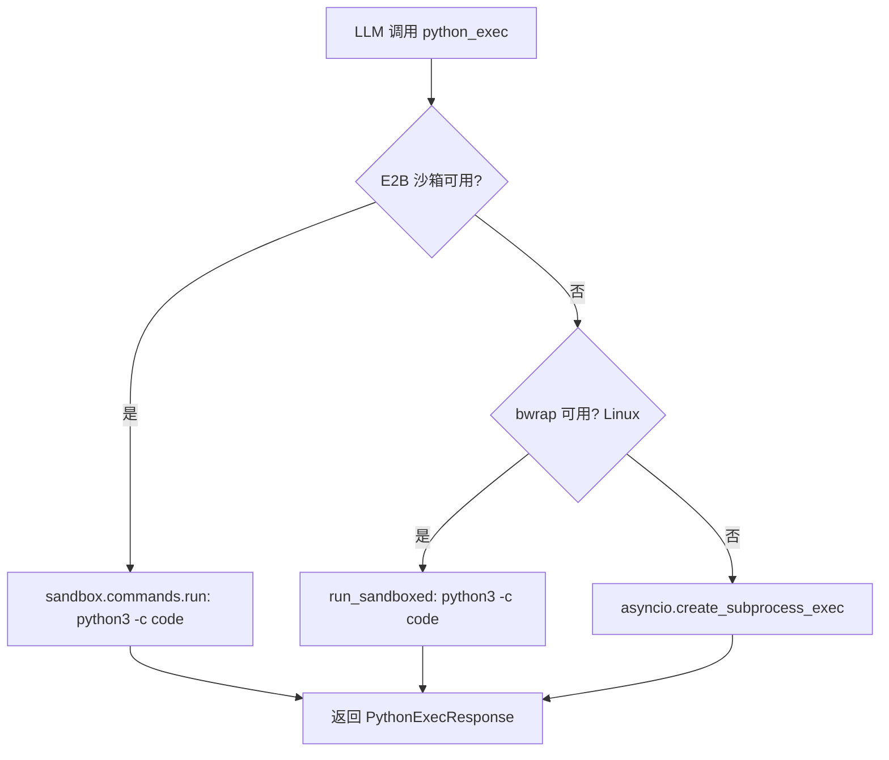

## 用户需求

AI 在处理 base64 编码内容时无法可靠解码。现有的 `bash_exec` 工具依赖 bwrap 沙箱（仅 Linux）或 E2B 云沙箱（未配置），导致 Windows 环境下 LLM 只能"脑补"手动解码 base64，产生错误。

## 产品概述

新增 `python_exec` 工具，使 AI 能够执行 Python 代码片段。当用户（Windows）或未配置 E2B 的环境下也能可靠运行，解决 base64 解码等字节级操作的需求。

## 核心功能

- **Python 代码执行**：AI 可调用 `python_exec` 工具传入 Python 代码并获取 stdout/stderr/exit_code
- **三级回退策略**：E2B 沙箱 → bwrap 沙箱 → 主机直接 subprocess（Windows 兼容）
- **安全约束**：Python 隔离模式（`-I`）、超时限制（默认 30s，最大 120s）、代码长度限制（10KB）
- **与 bash_exec 一致的工具模式**：复用 BashExecTool 的架构、响应模型和工具注册方式

## 技术栈

- 语言：Python 3
- 框架：FastAPI（现有后端）
- 核心依赖：`asyncio.create_subprocess_exec`（主机回退）、e2b SDK（云沙箱路径）
- 遵循现有模式：`BashExecTool` → `BaseTool` 继承体系

## 实现方案

### 总体策略

完全复用 `BashExecTool` 的架构模式，新增第三个执行回退路径（主机 subprocess），使工具在 Windows 环境下也可用。

### 执行流程



### 三级回退设计

| 层级 | 条件 | 实现 | 隔离程度 |
| --- | --- | --- | --- |
| 1 | E2B 沙箱存在 | `sandbox.commands.run("python3 -c ...")` | 强（云容器） |
| 2 | bwrap 可用 | `run_sandboxed(["python3", "-c", code])` | 强（本地沙箱） |
| 3 | 以上均不可用 | `asyncio.create_subprocess_exec("python3", "-I", "-c", code)` | 弱（进程级） |


### 主机回退安全措施

- `python3 -I`：隔离模式，忽略 PYTHONPATH 和环境中的 site-packages
- `asyncio.wait_for(proc.communicate(), timeout=timeout)`：超时自动终止
- 代码长度上限 10000 字符
- 捕获 stdout/stderr 并限制输出大小

### 关键决策

- **不复用 bash_exec 内部调用 python3**：bash_exec 在无 sandbox 时直接报错退出，不会进入 subprocess 路径。需要独立的 PythonExecTool 来实现主机回退。
- **默认 requires_auth = False**：与 BashExecTool 不同，python_exec 不注入用户 token，可在匿名场景使用。
- **is_available = True**：始终可用（主机回退保证）。
- **超时默认 30s**：Python 脚本通常比 shell 命令快，降低默认超时。

## 实现细节

### 性能

- 主机回退路径：subprocess 启动延迟约 100-300ms，对于 base64 解码等任务可忽略
- 超时后通过 `proc.kill()` 强制终止，避免僵尸进程

### 日志

- 复用 `logging.getLogger(__name__)` 模式
- 记录执行层级（e2b/bwrap/direct）和耗时
- 错误日志包含截断后的代码片段（前 200 字符），避免日志膨胀

### 向后兼容

- 不影响现有 bash_exec 行为
- 新增响应类型 `PYTHON_EXEC` 不与其他类型冲突
- 工具注册仅新增条目，不修改已有注册

## 目录结构

```
autogpt_platform/backend/backend/copilot/tools/
├── models.py              # [MODIFY] 新增 PYTHON_EXEC 响应类型和 PythonExecResponse 模型
├── python_exec.py         # [NEW] PythonExecTool 实现，含三级回退执行逻辑
└── __init__.py            # [MODIFY] 注册 python_exec 到 TOOL_REGISTRY
```

### 文件详情

**models.py** [MODIFY]

- 第 83 行 `BASH_EXEC = "bash_exec"` 后新增 `PYTHON_EXEC = "python_exec"`
- 第 651 行 `BashExecResponse` 后新增 `PythonExecResponse(ToolResponseBase)` 类，字段与 BashExecResponse 完全一致：`stdout: str`, `stderr: str`, `exit_code: int`, `timed_out: bool = False`

**python_exec.py** [NEW]

- 创建 `PythonExecTool(BaseTool)` 类
- 属性：`name = "python_exec"`, `description` 描述 Python 执行能力, `parameters` 定义 `code`(必填) 和 `timeout`(默认 30) 两个参数
- `_execute()` 方法实现三级分发：E2B → bwrap → 主机 subprocess
- `_execute_direct()` 私有方法：使用 `asyncio.create_subprocess_exec("python3", "-I", "-c", code)` + `asyncio.wait_for` 实现主机回退
- `_execute_on_e2b()` 私有方法：复用 bash_exec 中 E2B 执行模式，改用 `python3 -c`
- `_execute_on_bwrap()` 私有方法：复用 `run_sandboxed(["python3", "-c", code])`
- 代码长度校验：超过 `_MAX_CODE_LENGTH = 10000` 返回 ErrorResponse
- 超时处理：捕获 `asyncio.TimeoutError` 后 `proc.kill()` 并返回 timed_out=True

**init.py** [MODIFY]

- 第 15 行 `bash_exec` 导入后新增 `from .python_exec import PythonExecTool`
- 第 119 行 `bash_exec` 注册后新增 `"python_exec": PythonExecTool()`