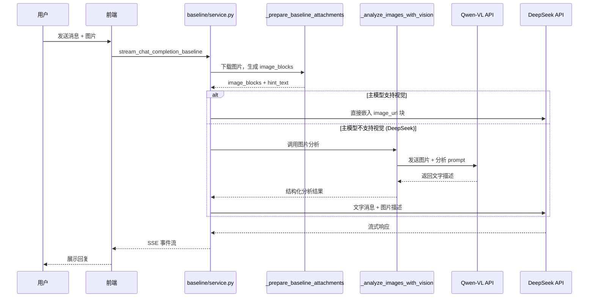

## 用户需求

为 copilot 系统添加图像识别能力。当前系统使用 DeepSeek 作为主模型，不支持视觉输入，图片仅能作为文件元信息传递，模型无法真正理解图片内容。

## 产品概述

采用**预处理模式**：当用户上传图片时，系统先调用 Qwen-VL（通义千问视觉模型）分析图片并生成详细文字描述，然后将描述注入到用户消息中，使 DeepSeek 能够间接"看到"图片内容。DeepSeek 作为主对话模型保持不变，Qwen-VL 仅作为图像分析的预处理步骤。

## 核心功能

- **视觉模型配置**：新增 Qwen-VL 的模型名、API Key、Base URL 等配置项，支持环境变量覆盖
- **图片预处理分析**：当检测到用户上传图片且主模型不支持视觉时，自动调用 Qwen-VL API 对每张图片生成文字描述
- **智能消息注入**：将 Qwen-VL 的分析结果以结构化文本格式注入到用户消息中，让 DeepSeek 能基于描述进行推理
- **降级容错**：视觉分析失败时自动降级为原有的文本注释模式，不影响对话流程

## 技术栈

- **主对话模型**：DeepSeek（deepseek-chat / deepseek-reasoner），通过 OpenAI 兼容 API 调用
- **视觉分析模型**：Qwen-VL（qwen-vl-max），通过阿里云 DashScope OpenAI 兼容端点
- **API 客户端**：LangfuseAsyncOpenAI（复用现有客户端工厂模式）
- **配置管理**：Pydantic BaseSettings（ChatConfig），环境变量自动映射
- **后端语言**：Python，异步（asyncio）

## 实现方案

### 整体策略

在现有图片处理管线中插入一个**视觉预处理步骤**。当 `_prepare_baseline_attachments` 生成 `image_blocks` 后，在消息组装阶段（`stream_chat_completion_baseline` 的 L1971-L1985），原本的非视觉模型分支只添加一条文本注释。修改后，该分支会先调用 `_analyze_images_with_vision()` 用 Qwen-VL 分析图片，将结果作为结构化文本注入用户消息。

### 关键技术决策

1. **视觉客户端复用模式**：遵循现有 `_get_main_client()` / `_get_aux_client()` 的单例工厂模式，新增 `_get_vision_client()` 函数。视觉客户端使用独立凭证，不污染主对话客户端。

2. **异步顺序调用**：图片分析在消息注入阶段 **顺序执行**（非并发），因为：

- 通常用户上传图片数量少（1-3 张）
- Qwen-VL API 有并发限制
- 分析结果的质量比延迟更重要

3. **结构化提示词**：发送给 Qwen-VL 的 prompt 包含用户原始问题 + 英文分析指令，确保生成的描述详细、结构化、与用户意图相关。

4. **结果注入格式**：分析结果以 `[Image Analysis Results]` 标记块注入用户消息末尾，与现有的 attachment hint / context hint 保持一致的格式风格。

5. **降级策略**：任何视觉 API 调用失败（网络、认证、超时等）都静默降级为原有 text-note 行为，确保图片上传不会导致整个请求失败。

### 架构设计



## 实现细节

### 文件修改清单

#### 1. `backend/copilot/config.py` - 新增视觉模型配置

新增以下字段到 `ChatConfig` 类：

| 字段 | 默认值 | 环境变量覆盖 | 说明 |
| --- | --- | --- | --- |
| `vision_model` | `"qwen-vl-max"` | `CHAT_VISION_MODEL` | Qwen-VL 模型名，可选 `qwen-vl-plus` |
| `vision_api_key` | `None` | `CHAT_VISION_API_KEY`，回退 `DASHSCOPE_API_KEY` | 阿里云 DashScope API Key |
| `vision_base_url` | `"https://dashscope.aliyuncs.com/compatible-mode/v1"` | `CHAT_VISION_BASE_URL` | Qwen-VL OpenAI 兼容端点 |
| `vision_enabled` | `True` | `CHAT_VISION_ENABLED` | 是否启用视觉预处理 |


新增 property `vision_client_credentials`，返回 `(vision_api_key, vision_base_url)` 元组，`vision_api_key` 用与 `api_key` 类似的 `@field_validator` 回退逻辑。

#### 2. `backend/copilot/baseline/service.py` - 核心修改

**新增函数 `_get_vision_client()`**：

- 模块级单例工厂，创建 `LangfuseAsyncOpenAI` 实例
- 使用 `config.vision_client_credentials`
- timeout=120.0（图片分析可能较慢），max_retries=1

**新增函数 `_analyze_images_with_vision()`**：

```python
async def _analyze_images_with_vision(
    image_blocks: list[dict[str, Any]],
    user_text: str = "",
) -> str | None
```

- 参数：`image_blocks`（来自 `_prepare_baseline_attachments` 的 base64 图片数据）、`user_text`（用户的文字消息，辅助 Qwen-VL 聚焦分析）
- 内部将 Anthropic 格式的 image_blocks 转换为 OpenAI `image_url` 格式
- 构造 messages：包含系统级分析指令 + 用户图片 + 上下文 prompt
- 调用 `_get_vision_client().chat.completions.create()`，非流式调用
- 返回结构化分析结果文本；失败返回 `None`
- 捕获所有异常并 log warning，静默降级

**修改 `stream_chat_completion_baseline` 的图片注入逻辑**（约 L1971-L1985）：

将现有的 `else` 分支（非视觉模型）从直接附加 note 改为：

```python
else:
    # 尝试用 Qwen-VL 预处理图片
    vision_result = await _analyze_images_with_vision(
        image_blocks,
        user_text=original_user_text  # 传入用户原始问题
    )
    if vision_result:
        # 注入分析结果代替图片
        text = text + vision_result
    else:
        # 降级：原有 note 行为
        text = text + note
    openai_messages[i]["content"] = text
```

其中 `original_user_text` 需要从消息中提取——在调用 `_analyze_images_with_vision` 之前保存当前用户消息的原始文本内容。

### 性能考量

- Qwen-VL API 调用增加了约 2-5 秒延迟（取决于图片大小和数量）
- 仅在有图片且主模型不支持视觉时触发，对纯文本对话无影响
- 图片 base64 数据在 `image_blocks` 中已就绪，无需二次编码
- 使用 `vision_enabled` 开关可完全禁用预处理，便于运维控制

### 日志与监控

- 使用现有 `logger = logging.getLogger(__name__)`
- 成功时记录 INFO：分析耗时、图片数量
- 失败时记录 WARNING（含异常信息），不中断请求
- 不记录图片 base64 数据，避免日志膨胀和隐私泄露

### 向后兼容性

- 不影响视觉模型路径（`_model_supports_vision` 为 True 时逻辑不变）
- `vision_enabled=False` 或 `vision_api_key` 未配置时行为完全等同于当前版本
- 所有新增字段有合理默认值，已有部署无需修改环境变量即可运行

### 目录结构

```
autogpt_platform/backend/backend/copilot/
├── config.py              # [MODIFY] 新增 vision_model/vision_api_key/vision_base_url/vision_enabled 字段及 vision_client_credentials property
├── baseline/
│   └── service.py         # [MODIFY] 新增 _get_vision_client()、_analyze_images_with_vision()，修改图片注入逻辑（L1971-L1985）
```