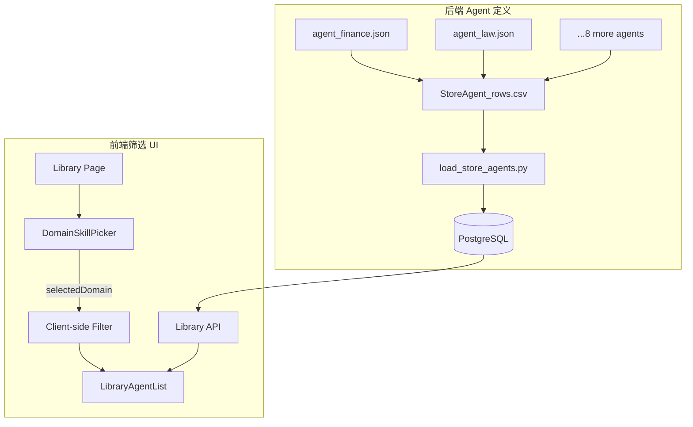

## 用户需求

为 AutoGPT 项目添加 10 个垂直领域的预设智能体，每个智能体拥有不同领域的研究能力，通过定制化的系统提示词（sys_prompt）区分各自领域专长。同时在前端 Library 页面增加领域技能筛选按钮，方便用户按垂直领域快速筛选和选择 Agent。

## 产品概述

在现有 AutoGPT 平台的 Agent Library 系统中，新增一组覆盖 10 大垂直领域的预设智能体，并配套前端领域筛选 UI。用户进入 Library 页面后，可通过新增加的领域标签/按钮一键筛选对应领域的智能体，选中后运行该智能体即可获得该垂直领域的专业 AI 研究能力。

## 核心功能

- **10 个垂直领域预设智能体**：财务(Finance)、法律(Law)、研发(R&D)、运营(Operations)、教育(Education)、医疗(Healthcare)、金融(Finance/Banking)、农业(Agriculture)、媒体与娱乐(Media & Entertainment)、艺术与设计(Art & Design)
- **领域定制化系统提示词**：每个智能体的 OrchestratorBlock 中配置专属 sys_prompt，明确其领域角色、专业能力边界、研究方法和输出规范
- **前端领域技能筛选栏**：在 Library 页面搜索栏下方新增一组可水平滚动的领域标签按钮，点击即可筛选对应类别的 Agent
- **与现有 Library 系统无缝集成**：Agent 通过标准 JSON 格式定义，CSV 元数据注册，前端筛选复用现有 LibraryAgentList 的数据流

## 技术栈

- **后端**：Python (FastAPI + Prisma ORM)，Agent 以 JSON 图定义存储
- **前端**：Next.js + React + TypeScript + Tailwind CSS + Zustand
- **Agent 运行时**：OrchestratorBlock（block_id: `3b191d9f-356f-482d-8238-ba04b6d18381`）作为 AI 编排核心

## 实现方案

### 整体策略

采用"JSON 图定义 + CSV 元数据注册"的标准 AutoGPT Agent 加载模式，完全复用现有的 `load_store_agents.py` 数据导入流程。每个垂直领域 Agent 复用同一套简洁的图拓扑（Input → Orchestrator → Output），仅通过 OrchestratorBlock 的 `sys_prompt` 字段实现领域差异化。前端新增 `DomainSkillPicker` 组件，以 category 字段为桥梁连接 Agent 定义和 UI 筛选。

### 关键技术决策

1. **Agent 结构复用**：所有 10 个 Agent 使用相同的图结构（3 节点拓扑），避免重复造轮子，降低维护成本。每个 Agent JSON 的唯一差异在于 name、description 和 OrchestratorBlock 的 sys_prompt。

2. **领域标识方案**：利用现有的 StoreListing `categories` 字段标记领域。在 CSV 中为每个 Agent 设置 `categories: ["finance"]` 等唯一领域标签，前端通过 Library API 的搜索/过滤参数（`searchTerm`）或客户端侧 categories 匹配实现筛选。

3. **前端筛选实现**：采用客户端侧 category 匹配方案。Agent 数据已从 API 获取，在前端通过 `DomainSkillPicker` 设置选中的领域标签，`useLibraryAgentList` hook 根据标签过滤 agents 数组。这种方式无需修改后端 API，实时响应，体验流畅。

4. **sys_prompt 设计原则**：每个领域的 sys_prompt 遵循三段式结构：

- **角色定义**：明确专业身份和能力范围
- **方法指导**：该领域研究的标准方法和注意事项
- **输出规范**：要求的结构化输出格式和引用规范

### 实现细节

**性能考量**：

- 领域筛选为客户端侧过滤，无额外网络请求，响应即时
- Agent JSON 体积控制在 5KB 以内（3 节点精简图）
- `DomainSkillPicker` 使用 CSS scroll-snap 实现流畅横向滚动

**可扩展性**：

- 新增领域只需：创建 JSON + 添加 CSV 行 + 在 `DOMAINS` 数组中添加一项
- sys_prompt 集中管理在 JSON 文件中，修改不影响代码

**日志与错误处理**：

- Agent JSON 导入失败时 `load_store_agents.py` 已有完善的错误收集和报告机制
- 前端筛选边界处理：无匹配结果时显示 EmptyState

## 架构设计

### 系统架构

本次修改涉及两个子系统：

1. **Agent 定义系统**（后端 agents/ 目录 + CSV 元数据）
2. **前端筛选 UI 系统**（Library 页面 + 新组件）



### 数据流

用户点击领域标签 → `DomainSkillPicker` 更新 `selectedDomain` 状态 → `useLibraryAgentList` 根据 `category` 字段过滤 agents 数组 → `LibraryAgentList` 仅渲染匹配的 Agent 卡片

## 目录结构

```
AutoGPT-master/autogpt_platform/
├── backend/
│   └── agents/
│       ├── agent_vertical_finance.json        # [NEW] 财务领域智能体
│       ├── agent_vertical_law.json            # [NEW] 法律领域智能体
│       ├── agent_vertical_rd.json             # [NEW] 研发领域智能体
│       ├── agent_vertical_operations.json     # [NEW] 运营领域智能体
│       ├── agent_vertical_education.json      # [NEW] 教育领域智能体
│       ├── agent_vertical_healthcare.json     # [NEW] 医疗领域智能体
│       ├── agent_vertical_banking.json        # [NEW] 金融领域智能体
│       ├── agent_vertical_agriculture.json    # [NEW] 农业领域智能体
│       ├── agent_vertical_media.json          # [NEW] 媒体与娱乐领域智能体
│       ├── agent_vertical_artdesign.json      # [NEW] 艺术与设计领域智能体
│       └── StoreAgent_rows.csv               # [MODIFY] 新增 10 行领域 Agent 元数据
├── frontend/src/app/(platform)/library/
│   ├── page.tsx                              # [MODIFY] 集成 DomainSkillPicker，管理 selectedDomain 状态
│   ├── types.ts                              # [MODIFY] 新增 DomainId 类型和 DOMAIN_CONFIG 常量
│   └── components/
│       └── DomainSkillPicker/
│           └── DomainSkillPicker.tsx          # [NEW] 领域技能筛选器组件
```

## 关键代码结构

### DomainSkillPicker 组件接口

```typescript
// types.ts - 新增类型
export type DomainId =
  | "finance"
  | "law" 
  | "rd"
  | "operations"
  | "education"
  | "healthcare"
  | "banking"
  | "agriculture"
  | "media"
  | "artdesign";

export interface DomainConfig {
  id: DomainId;
  label: string;       // e.g. "财务"
  englishLabel: string; // e.g. "Finance"  
  icon: string;        // emoji or component name
}

export const DOMAINS: DomainConfig[] = [
  { id: "finance", label: "财务", englishLabel: "Finance", icon: "💰" },
  // ... 其余 9 个领域
];

// DomainSkillPicker Props
interface DomainSkillPickerProps {
  selectedDomain: DomainId | null;
  onDomainSelect: (domain: DomainId | null) => void;
}
```

### Agent JSON 图结构（所有 10 个 Agent 共用模板）

每个 JSON 文件包含：

- 3 个 nodes：Input Block → OrchestratorBlock → Output Block
- 2 条 links：Input.result → Orchestrator.prompt，Orchestrator.finished → Output.value
- OrchestratorBlock 的 input_default 中定制 `sys_prompt` 和 `model`
- 唯一差异：顶层的 `id`（UUID）、`name`、`description`，以及 OrchestratorBlock 的 `sys_prompt` 内容

## 设计风格

采用现代极简风格，与现有 Library 页面视觉系统保持一致。领域技能筛选器使用 Pill/Chip 形态的横向滚动标签组，配合柔和的色彩标识和微交互效果。

## DomainSkillPicker 组件设计

### 布局

- 位于 LibraryActionHeader（搜索栏 + Import 按钮）下方、LibrarySubSection（All/Favorites 标签 + 排序筛选）上方
- 水平方向排列，支持 overflow-x 滚动，左右两侧各有渐变遮罩提示可滚动内容
- 每个领域标签为一个 Pill 按钮，包含 emoji 图标和中文名称

### 样式

- 默认状态：浅灰背景 (bg-zinc-100)，深灰文字 (text-zinc-700)，无边框
- 选中状态：深色/品牌色背景 (bg-zinc-900 或 bg-primary)，白色文字
- hover 时：背景略微加深，有轻微缩放 (scale-[1.02])
- 标签间距：gap-2，左右内边距 px-4
- 整体区域上下内边距 py-3

### 交互

- 点击标签切换选中状态（单选模式）
- 再次点击已选中标签可取消选择（回到全部）
- 选中某个领域后，下方 Agent 列表实时过滤
- 过渡动画：背景色和文字色变化使用 150ms ease transition

### 响应式

- 桌面端：标签完整显示，无滚动
- 平板/移动端：出现水平滚动条，左右渐变遮罩指示可滚动内容