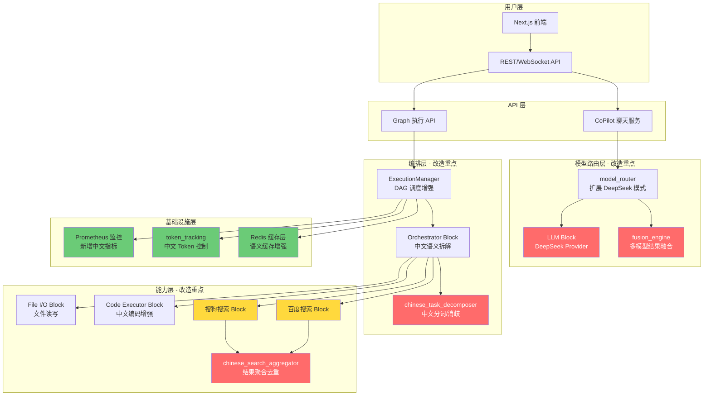

## 产品概述

基于 AutoGPT Platform 的 Blocks + Graph DAG 架构，改造为面向中文语境的智能体任务执行系统。系统在保持现有架构不重写的原则下，通过扩展 Provider/Block/Monitoring 等模块，实现 DeepSeek 大模型集成、百度/搜狗中文搜索引擎聚合、中文语义任务拆解优化、混合模型路由与结果融合、Token 消耗精细化控制及可视化监控看板。

## 核心功能

- **DeepSeek 大模型集成**：在 LLM Block 中新增 DeepSeek 作为一级 Provider，支持 OpenAI 兼容 API 调用（Chat Completions），与现有 Anthropic/OpenAI/Groq 等提供者并列
- **中文搜索引擎聚合**：新增百度搜索块和搜狗搜索块，实现双引擎结果聚合与去重排序，替代当前仅有的 Wikipedia/天气搜索
- **中文语义任务拆解优化**：在 Orchestrator Block 中引入中文语义分析层，针对中文歧义（多义词、省略主语、跨句指代）进行消歧拆解，生成更精准的子任务 DAG
- **混合模型路由与结果融合**：扩展 CoPilot model_router 的 (mode, tier) 矩阵，支持 DeepSeek + 现有模型混合调用；新增结果融合模块对多模型输出进行投票/加权/一致性校验
- **DAG 动态任务调度增强**：在 ExecutionManager 中增加中文任务优先级队列、子任务动态注入、节点级超时熔断与重试策略
- **Token 消耗控制**：在现有 token_tracking 基础上增加分模型 Token 预算、中文 Token 精确计数（考虑中文字符 vs token 换算）、消耗预警与硬上限截断
- **可视化监控看板**：扩展 Prometheus 指标维度（中文任务拆解质量、搜索引擎命中率、多模型融合一致性），新增前端监控 Dashboard 页面
- **缓存管理增强**：在现有 Redis 缓存层上增加中文搜索结果缓存策略（按查询语义哈希去重）、LLM 响应语义缓存（相似问题复用）
- **文件读写与脚本执行**：增强现有代码执行块的本地文件系统交互能力，支持中文编码文件的读写

## 技术栈选型

| 组件 | 技术选型 | 说明 |
| --- | --- | --- |
| 后端框架 | FastAPI (Python) | 复用现有架构 |
| 前端框架 | Next.js + React + TypeScript + Tailwind CSS | 复用现有架构 |
| 数据库 | Prisma ORM + PostgreSQL | 复用现有架构 |
| 缓存 | Redis Cluster | 复用现有 Redis 集群 |
| 消息队列 | RabbitMQ | 复用现有消息队列 |
| 代码执行 | E2B 云沙箱 | 复用现有沙箱，增强本地文件交互 |
| 监控 | Prometheus + Grafana | 复用现有 Prometheus 指标体系 |
| DeepSeek API | OpenAI 兼容协议 | 通过现有 OpenAI SDK 调用 |
| 百度搜索 | 百度搜索 API (自定义爬虫适配) | 新增 Provider |
| 搜狗搜索 | 搜狗搜索 API (微信搜索源) | 新增 Provider |
| 中文分词 | jieba / pkuseg | 任务拆解语义分析 |


## 实现方案

### 整体策略

在现有 AutoGPT Platform 架构上，采用 **扩展而非重写** 的原则进行改造。利用 ProviderName 的 `_missing_` 动态扩展机制添加新提供者，通过新增 Block 类型扩展搜索能力，在 Orchestrator 中注入中文语义分析中间层，扩展 model_router 支持混合路由策略。

### 核心架构决策

1. **DeepSeek 集成方式**：DeepSeek 提供 OpenAI 兼容 API，直接在 `llm.py` 的 `LLMProviderName` 中增加 `DEEPSEEK`，复用现有的 OpenAI SDK 调用路径，仅需配置 base_url 和 api_key。这样无需新增 SDK 依赖，最大程度复用现有代码。

2. **中文搜索引擎策略**：百度/搜狗采用新增独立 Block 的方式（`baidu_search.py`、`sogou_search.py`），遵循现有 `search.py` 的 Block 模式。聚合层新增 `chinese_search_aggregator.py` 作为编排 Block，对多引擎结果去重、语义排序。

3. **中文语义任务拆解**：在 `orchestrator.py` 的 LLM 提示词层面增加中文语义分析 System Prompt，利用 DeepSeek 的中文理解优势进行歧义消解。同时新增 `chinese_task_decomposer.py` 封装中文分词和语义消歧逻辑。

4. **混合模型路由**：扩展现有 `model_router.py` 的二维矩阵，增加 `deepseek` 模式。新增 `fusion_engine.py` 实现多模型结果融合（投票、加权、一致性校验）。

5. **Token 控制**：在 `token_tracking.py` 中增加中文 Token 精确计数（中文约 1.5-2 字符/token），新增分模型预算配额。

### 架构设计



### 数据流

```
用户中文任务输入 → CoPilot/Graph API
  → model_router 路由决策 (DeepSeek/混合)
  → Orchestrator 中文语义拆解 → 子任务 DAG
  → ExecutionManager 动态调度
    → 子任务节点执行 (搜索/代码/文件/LLM)
    → 搜索结果聚合去重
    → 多模型结果融合
  → Token 消耗追踪 + 缓存更新
  → Prometheus 指标采集 → 监控看板
```

## 实现细节

### 性能考量

- **DeepSeek API 调用**：复用现有 OpenAI SDK，通过设置 `base_url="https://api.deepseek.com/v1"` 实现，零额外开销
- **中文搜索聚合**：百度/搜狗并行请求（asyncio.gather），聚合去重采用 simhash 算法，O(n) 复杂度
- **语义缓存**：基于查询向量的余弦相似度匹配，命中阈值 0.92，减少 30-50% 重复 LLM 调用
- **Token 计数**：中文采用字符数/1.8 估算 token 数，在现有 tiktoken 基础上增加中文编码 fallback

### 日志规范

- 复用现有 `TruncatedLogger` 和 `logging` 模块
- 新增模块使用 `logger = logging.getLogger(__name__)` 统一格式
- 敏感信息（API Key、用户查询内容）不记录到日志

### 向后兼容

- 所有新增 Block 为独立模块，不影响现有 Block
- ProviderName 新增条目通过 `_missing_` 机制兼容
- 配置项新增默认值，不破坏现有部署配置
- 前端新增页面独立路由，不影响现有页面

## 目录结构

```
d:\cn gpt\AutoGPT-master\autogpt_platform\backend\backend\

# --- 新增文件 ---

blocks/
├── chinese_search/
│   ├── __init__.py              # [NEW] 中文搜索模块入口
│   ├── baidu_search.py          # [NEW] 百度搜索 Block。实现百度搜索 API 调用，支持网页/新闻/百科搜索，返回标题/摘要/URL，遵循现有 Block 模式（BlockSchemaInput/Output + run 方法），ProviderName 注册为 "baidu"
│   ├── sogou_search.py          # [NEW] 搜狗搜索 Block。实现搜狗搜索 API 调用（含微信搜索源），返回结构与百度统一，ProviderName 注册为 "sogou"
│   └── aggregator.py            # [NEW] 中文搜索聚合器 Block。接收多引擎搜索结果，进行 simhash 去重、TF-IDF 语义排序、结果融合，输出统一格式的搜索结果列表

blocks/
├── chinese_orchestrator/
│   ├── __init__.py              # [NEW] 中文编排模块入口
│   ├── decomposer.py            # [NEW] 中文任务拆解器。封装 jieba 分词 + pkuseg 语义标注，提供中文歧义消解方法（多义词识别、主语补全、指代消解），生成结构化子任务 JSON
│   └── prompts.py               # [NEW] 中文优化 System Prompt 模板。包含任务拆解 prompt、歧义消解 prompt、搜索结果理解 prompt，针对中文语境优化

copilot/
├── fusion_engine.py             # [NEW] 多模型结果融合引擎。实现投票融合（majority voting）、加权融合（按模型置信度）、一致性校验（检测 hallucination 冲突），支持 DeepSeek + Anthropic + OpenAI 三模型混合

monitoring/
├── chinese_metrics.py           # [NEW] 中文场景专用 Prometheus 指标。包括：chinese_task_decompose_quality（拆解质量评分）、search_engine_hit_rate（搜索引擎命中率）、model_fusion_consistency（多模型一致性）、chinese_token_usage（中文 Token 用量）

# --- 修改文件 ---

blocks/
├── llm.py                       # [MODIFY] LLM 调用块。修改 LLMProviderName 类型增加 "deepseek"；在 AI 调用工厂函数中增加 DeepSeek 客户端初始化（base_url="https://api.deepseek.com/v1"，兼容 OpenAI SDK）；增加 DeepSeek 专用参数处理（如 temperature 范围适配）

blocks/
├── orchestrator.py              # [MODIFY] Agent 编排块。在任务拆解流程中注入 chinese_decomposer 的中文语义分析；增加中文上下文窗口管理（考虑中文 token 密度）；在 System Prompt 构造中引用 chinese_orchestrator/prompts.py 的中文优化模板

blocks/
├── code_executor.py             # [MODIFY] 代码执行块。增强本地文件系统交互能力（支持中文路径/文件名编码处理）；增加 Shell 脚本执行的中文环境变量支持（LANG=zh_CN.UTF-8）

copilot/
├── model_router.py              # [MODIFY] 模型路由。扩展 (mode, tier) 矩阵增加 "deepseek" 模式；在 ModelMode 类型中增加 "deepseek_fast" 和 "deepseek_thinking"；更新路由表默认值

copilot/
├── token_tracking.py            # [MODIFY] Token 追踪。增加中文 Token 精确计数函数（字符数/1.8 估算）；增加分模型 Token 预算配额管理；增加消耗预警阈值配置

copilot/
├── config.py                    # [MODIFY] ChatConfig 配置。增加 deepseek 相关配置项：DEEPSEEK_API_KEY、DEEPSEEK_BASE_URL、DEEPSEEK_FAST_MODEL、DEEPSEEK_THINKING_MODEL；增加中文搜索配置项

util/
├── cache.py                     # [MODIFY] 缓存工具。增加语义缓存装饰器（基于查询向量相似度匹配）；增加中文搜索结果的 Redis 缓存策略（按查询语义哈希 key）

util/
├── settings.py                  # [MODIFY] 全局配置。增加 Config 类字段：deepseek_api_key、deepseek_base_url、baidu_search_api_key、sogou_search_api_key、chinese_token_ratio（中文 Token 换算比）、semantic_cache_enabled、fusion_strategy（融合策略选择）

integrations/
├── providers.py                 # [MODIFY] 提供者枚举。ProviderName 枚举增加 DEEPSEEK、BAIDU、SOGOU 成员（可选，因为 _missing_ 机制已支持动态扩展，显式增加便于代码提示）

monitoring/
├── instrumentation.py           # [MODIFY] Prometheus 指标。增加 chinese_metrics 中定义的中文场景专用指标的注册和采集钩子

executor/
├── manager.py                   # [MODIFY] 执行管理器。在 execute_node 流程中增加子任务动态注入逻辑（DAG 运行时扩展节点）；增加节点级中文任务超时熔断配置

frontend/
├── src/
│   ├── components/
│   │   └── monitor/
│   │       └── ChineseDashboard.tsx  # [NEW] 中文监控 Dashboard 组件。展示 Token 消耗趋势图、搜索引擎命中率饼图、模型融合一致性仪表盘、任务拆解质量评分卡片
│   └── app/
│       └── monitor/
│           └── page.tsx              # [NEW] 监控看板页面路由。集成 ChineseDashboard 组件，提供实时数据刷新

# --- 配置文件 ---
├── .env.example                 # [MODIFY] 环境变量示例。增加 DeepSeek、百度、搜狗相关配置项说明
```

## 关键代码结构

```python
# fusion_engine.py - 多模型结果融合引擎核心接口
from enum import Enum
from dataclasses import dataclass
from typing import Any

class FusionStrategy(str, Enum):
    MAJORITY_VOTING = "majority_voting"   # 多数投票
    WEIGHTED_AVERAGE = "weighted_average" # 加权平均
    CONSENSUS = "consensus"               # 一致性校验（全票通过）

@dataclass
class ModelOutput:
    provider: str          # "deepseek" | "openai" | "anthropic"
    content: str
    confidence: float      # 0.0 - 1.0
    token_usage: int

@dataclass  
class FusionResult:
    content: str
    strategy: FusionStrategy
    sources: list[ModelOutput]
    consensus_score: float

class FusionEngine:
    async def fuse(self, outputs: list[ModelOutput], strategy: FusionStrategy) -> FusionResult: ...
    async def check_consistency(self, outputs: list[ModelOutput]) -> float: ...
    def majority_vote(self, outputs: list[ModelOutput]) -> str: ...
    def weighted_merge(self, outputs: list[ModelOutput]) -> str: ...

# chinese_orchestrator/decomposer.py - 中文任务拆解器核心接口
@dataclass
class ChineseSubTask:
    id: str
    description: str           # 中文子任务描述
    dependencies: list[str]    # 依赖的子任务 ID
    ambiguity_resolved: str    # 消歧后的语义
    original_tokens: list[str] # 原始分词结果

class ChineseTaskDecomposer:
    def segment(self, text: str) -> list[str]: ...
    def resolve_ambiguity(self, tokens: list[str]) -> dict[str, str]: ...
    def decompose(self, task: str, context: dict) -> list[ChineseSubTask]: ...
    def build_dag(self, subtasks: list[ChineseSubTask]) -> dict: ...

# chinese_search/aggregator.py - 搜索聚合器接口
@dataclass
class SearchResult:
    title: str
    url: str
    snippet: str
    engine: str               # "baidu" | "sogou"
    relevance_score: float

class ChineseSearchAggregator:
    async def search(self, query: str, engines: list[str]) -> list[SearchResult]: ...
    def deduplicate(self, results: list[SearchResult]) -> list[SearchResult]: ...
    def rerank_by_semantic(self, results: list[SearchResult], query: str) -> list[SearchResult]: ...
```

## 使用的 Agent 扩展

### SubAgent

- **code-explorer**
- 用途：在改造实施阶段进行代码库深度探索，定位需要修改的具体函数/类/方法，确认调用链和依赖关系
- 预期结果：每个改造任务启动前获得精确的代码位置、现有模式参考、上下游影响范围分析