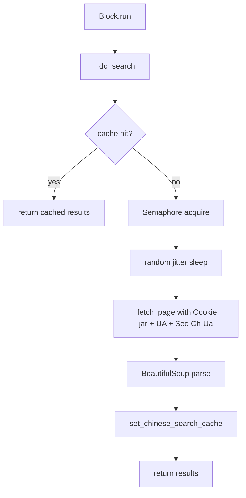

## 用户需求

修复 AutoGPT 项目中文搜索块（百度/搜狗）的三个关键问题：

1. **Brotli 解码 Bug**：Agent 图内搜索块因 Brotli 压缩无法解压导致搜索结果为空
2. **反反爬能力不足**：UA 池过时、缺少客户端提示头、无 Cookie/Referer，易被百度验证码拦截
3. **搜索缓存缺失**：项目已有完整中文搜索缓存 API 但搜索块未集成

## 核心修复项

1. 从 `baidu_search.py` 和 `sogou_search.py` 的 Accept-Encoding 头中移除 `br` 声明
2. 扩充 UA 池至 20+ 个（含移动端 iOS/Android），添加 Sec-Ch-Ua 系列客户端提示头，添加 Cookie jar 持久化和 Referer
3. 在搜索块的 `_do_search` 方法中集成已有 `get_chinese_search_cache` / `set_chinese_search_cache`
4. 添加模块级 `asyncio.Semaphore` 限流（每秒最多 1 次搜索请求，含随机抖动）

## 技术栈

- Python 3 + aiohttp（异步 HTTP）
- BeautifulSoup + lxml（HTML 解析）
- Redis（缓存后端，已配置）
- 已有缓存工具：`backend.util.cache` 中的 `get_chinese_search_cache` / `set_chinese_search_cache`

## 实现方案

### 1. Brotli Bug 修复（1 行 × 2 文件）

两个文件的 `_fetch_page` 方法中各改一行：

```python
# 修改前
"Accept-Encoding": "gzip, deflate, br",
# 修改后
"Accept-Encoding": "gzip, deflate",
```

aiohttp 原生只支持 gzip/deflate 自动解压（`auto_decompress=True` 默认开启），移除 `br` 后服务器不会返回 Brotli 编码，问题自然解决。

### 2. 反反爬增强

**扩充 UA 池**：添加 20+ 个 UA，覆盖 Chrome/Edge/Firefox/Safari + Windows/macOS/Linux/iOS/Android，使用 Chrome 130+ 等较新版本号。

**添加 Sec-Ch-Ua 客户端提示头映射**：为每个 UA 配置对应的 `Sec-Ch-Ua`、`Sec-Ch-Ua-Mobile`、`Sec-Ch-Ua-Platform` 头，这是现代反爬检测的核心维度。映射关系通过 UA 中的关键词自动推导（`Windows` → `"Windows"`，`Android` → `"Android"` 等）。

**添加 Cookie jar 持久化**：将 `_fetch_page` 中的每次新建 `ClientSession` 改为使用实例级 `aiohttp.CookieJar`，跨请求保持 Cookie 状态。

**添加 Referer**：百度搜索设置 `Referer: https://www.baidu.com/`，搜狗网页搜索设置 `Referer: https://www.sogou.com/`。

### 3. 缓存集成

在 `_do_search` 方法中：

1. 搜索前调用 `await get_chinese_search_cache(query, engine="baidu")` 检查缓存
2. 命中则直接返回缓存结果
3. 未命中则执行实际搜索，成功后调用 `await set_chinese_search_cache(query, results, engine="baidu", ttl_seconds=300)` 存储（5 分钟 TTL）

缓存 key 使用 `chinese_semantic_hash()` 生成，相似查询可复用缓存。

### 4. 频率控制

在 `_do_search` 入口处使用模块级 `asyncio.Semaphore(1)` + `asyncio.sleep(random.uniform(0.1, 0.5))` 随机抖动，确保每秒最多 1 次对同一引擎的实际网络请求。

### 架构设计

所有改动集中在两个 Block 文件内部，不改变 Block 的 Input/Output 接口，不影响 Agent 图的连接方式。改动仅影响 `_do_search` 和 `_fetch_page` 两个内部方法。



### 目录结构

```
backend/blocks/chinese_search/
├── baidu_search.py    # [MODIFY] Brotli fix + UA 池 + Sec-Ch-Ua + Cookie + Referer + 缓存 + 限频
├── sogou_search.py    # [MODIFY] 同上
├── aggregator.py      # [NO CHANGE] 聚合器无需修改
└── __init__.py         # [NO CHANGE]
```