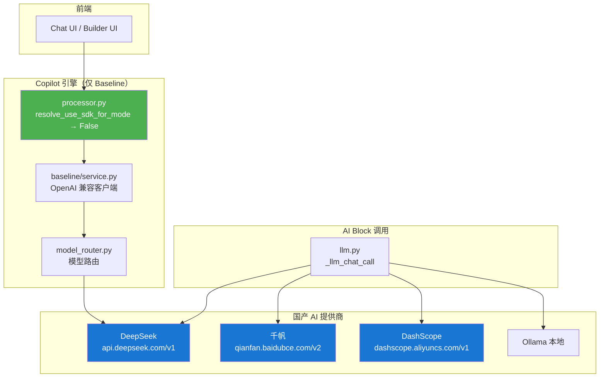

## 用户需求

将 AutoGPT 平台从依赖约 70 个国外大模型全面切换为仅使用国产大模型，确保前端对话聊天（Copilot）和 Builder 工作流功能正常运作。

## 核心功能

- **模型精简**：移除 LlmModel 枚举中所有 OpenAI、Anthropic、Google、Mistral 等国外模型，仅保留 DeepSeek、文心一言（百度千帆）、通义千问（阿里 DashScope）及本地 Ollama 模型
- **对话引擎改造**：强制 Copilot 走 baseline OpenAI 兼容路径，彻底关闭 Claude Agent SDK 调度，确保聊天功能可用
- **提供商扩展**：新增千帆（qianfan）和 DashScope 两个国产 AI 提供商，统一使用 OpenAI 兼容接口模式
- **配置重构**：更新 ChatConfig 默认模型、模型名规范化逻辑、成本计价、环境变量模板
- **Claude Code Block 禁用**：移除或禁用依赖 claude-agent-sdk 的 Claude Code Block

## 技术栈

- **后端语言**：Python 3.13+（原有）
- **AI 客户端**：`openai.AsyncOpenAI`（OpenAI 兼容接口，统一调用三国产模型）
- **配置管理**：Pydantic Settings（原有）
- **容器化**：Docker Compose（原有）

## 实现方案

### 核心策略：统一 OpenAI 兼容接口模式

三大国产模型均提供 OpenAI 兼容的 `/v1/chat/completions` 端点：

| 提供商 | Base URL | API Key 环境变量 |
| --- | --- | --- |
| DeepSeek | `https://api.deepseek.com/v1` | `DEEPSEEK_API_KEY` |
| 百度千帆 | `https://qianfan.baidubce.com/v2` | `QIANFAN_API_KEY` |
| 阿里 DashScope | `https://dashscope.aliyuncs.com/compatible-mode/v1` | `DASHSCOPE_API_KEY` |

这意味着所有提供商均可复用现有的 `openai.AsyncOpenAI(base_url=..., api_key=...)` 调用模式。`llm.py` 中已有的 `deepseek` 分支（L1357-1391）可直接作为千帆和 DashScope 的模板。

### Copilot 路径策略

- **强制 baseline 路径**：修改 `processor.py` 的 `resolve_use_sdk_for_mode` 函数始终返回 `False`
- **ChatConfig 默认模型切换**：`fast_standard_model` 从 `anthropic/claude-sonnet-4-6` 改为 `deepseek-chat`，`title_model` 同理
- **model_normalize.py 解耦**：移除 Anthropic 独占验证，改为通用国产提供商模型名透传
- **关闭 config.py Anthropic 绑定验证器**：`_validate_sdk_model_vendor_compatibility` 和 `_validate_aux_client_for_direct_main` 放宽或移除

### 架构设计

### 关键改动说明

1. **LlmModel 枚举改造** (`blocks/llm.py`)

- 移除所有国外模型枚举值（OpenAI/Anthropic/Google/Mistral/Cohere/Perplexity/Nous/Amazon/Microsoft/Gryphe/xAI/Kimi 等约 60+ 个值）
- 保留 DeepSeek V3/R1、Ollama 本地模型、国产 OpenRouter 模型（如智谱 GLM）
- 新增：`ERNIE_4_0_TURBO`、`ERNIE_SPEED_PRO`、`ERNIE_LITE_PRO`、`QWEN_MAX`、`QWEN_PLUS`、`QWEN_TURBO`
- 新增对应的 `ModelMetadata` 条目，`provider` 设为 `"qianfan"` 或 `"dashscope"`

2. **提供商调度扩展** (`llm.py` 调度函数)

- 新增 `qianfan` 分支：`openai.AsyncOpenAI(base_url=settings.config.qianfan_base_url)`
- 新增 `dashscope` 分支：`openai.AsyncOpenAI(base_url=settings.config.dashscope_base_url)`
- `LLMProviderName` Literal 新增 `ProviderName.QIANFAN`、`ProviderName.DASHSCOPE`

3. **Settings 配置** (`util/settings.py`)

- Config 新增：`qianfan_base_url`、`qianfan_default_model`、`dashscope_base_url`、`dashscope_default_model`
- Secrets 新增：`qianfan_api_key`、`dashscope_api_key`

4. **ProviderName 扩展** (`integrations/providers.py`)

- 新增 `QIANFAN = "qianfan"`、`DASHSCOPE = "dashscope"`

5. **Copilot ChatConfig 重构** (`copilot/config.py`)

- `fast_standard_model` 默认值 → `"deepseek-chat"`
- `fast_advanced_model` 默认值 → `"deepseek-reasoner"`
- `thinking_standard_model` 默认值 → `"deepseek-chat"`
- `thinking_advanced_model` 默认值 → `"deepseek-reasoner"`
- `title_model` 默认值 → `"deepseek-chat"`
- `simulation_model` 默认值 → `"deepseek-chat"`
- `use_claude_agent_sdk` 默认值 → `False`
- `use_deepseek` 默认值 → `True`
- `base_url` 默认值改为 `https://api.deepseek.com/v1`
- `api_key` 校验器添加 `DEEPSEEK_API_KEY` 回退
- `_validate_sdk_model_vendor_compatibility` 转为 NOP（SDK 已禁用）
- `_validate_aux_client_for_direct_main` 放宽验证允许国产模型名

6. **model_normalize.py 重构**

- 移除 Anthropic 独占验证逻辑
- 改为通用透传（国产模型名不需要前缀剥离）
- 仅保留 OpenRouter transport 时的 vendor/model 格式支持（兼容现有 OpenRouter 模型）

7. **processor.py 强制 Baseline**

- `resolve_use_sdk_for_mode`：mode 为 `"extended_thinking"` 时也返回 `False`
- 添加日志警告提示 SDK 路径已禁用

8. **model_router.py 适配**

- `_config_default` 函数保持不变（已是通用路由）
- 仅需确保 `deepseek` tier 默认值正确

9. **clients.py 扩展**

- `get_openai_client` 新增国产 API base URL 支持
- 移除 OpenRouter 默认依赖

10. **Claude Code Block 禁用**

    - `claude_code.py` 添加 SDK 不可用时的优雅降级或禁用标记

11. **环境变量模板** (`.env` / `.env.default`)

    - 新增：`DEEPSEEK_API_KEY`、`QIANFAN_API_KEY`、`DASHSCOPE_API_KEY`
    - 移除：`OPENAI_API_KEY`、`ANTHROPIC_API_KEY`、`GROQ_API_KEY`、`OPEN_ROUTER_API_KEY` 等的必要性说明

12. **MODEL_COST 重写** (`block_cost_config.py`)

    - 移除所有国外模型的成本条目
    - 新增千帆、DashScope 模型成本条目

### 性能考虑

- 三国产模型均使用 OpenAI 兼容接口，客户端实例可线程缓存复用，无额外连接开销
- 移除 OpenRouter 中间代理可减少 ~50ms 网络延迟
- SDK 子进程启动开销消除（不再启动 Claude Code CLI），内存节省 ~200MB

### 回退风险控制

- 所有改动集中在模型枚举和配置层面，不改变核心业务逻辑
- 保留 Ollama 本地模型支持作为离线回退方案
- Docker 重建镜像可完全回退至原始代码