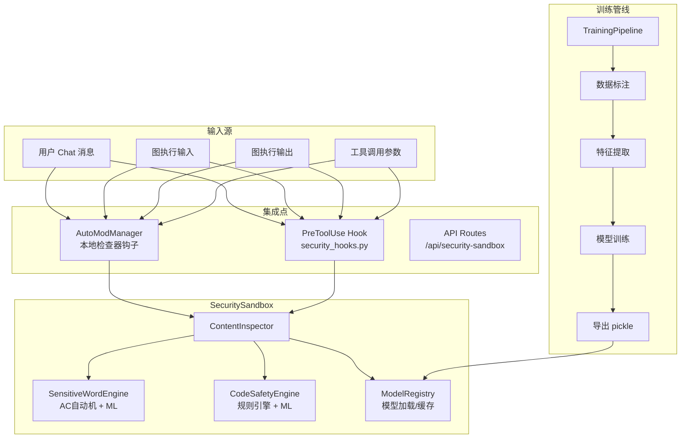

## 产品概述

在 AutoGPT 平台中内置安全沙箱与伦理审查模块，实现对用户输入和 AI 输出的敏感词拦截与代码安全检测，并提供离线训练管线支持自定义模型。

## 核心功能

- **敏感词拦截**：基于 AC 自动机的高效多模式匹配 + ML 语义分类器双引擎，支持中英文敏感词实时检测
- **代码安全检测**：正则规则引擎识别高危模式（SQL注入、XSS、命令注入、eval等）+ ML 分类器判断代码是否恶意
- **离线训练管线**：提供数据标注、特征提取（TF-IDF）、模型训练（LogisticRegression/SVM）、模型导出为 pickle 的完整流程
- **AutoMod 管道集成**：作为本地检查器接入现有 AutoModManager 的审核流程，在远程 AutoMod API 之前执行
- **Copilot 工具调用集成**：在 security_hooks.py 的 PreToolUse 钩子中引入安全审查，拦截危险工具调用

## 技术栈

| 层级 | 技术选型 |
| --- | --- |
| 敏感词匹配 | pyahocorasick（AC自动机，C扩展，O(n)匹配） |
| ML 特征 | scikit-learn TfidfVectorizer |
| ML 分类器 | scikit-learn LogisticRegression / LinearSVC |
| 代码分析 | ast 模块 + 正则规则 + ML分类器 |
| 序列化 | pickle / joblib |
| 异步审查 | asyncio.to_thread 在线程池运行同步推理 |
| 配置管理 | Pydantic Settings（与现有 ChatConfig 模式一致） |
| 依赖管理 | 新增到 requirements.txt |


## 系统架构



## 目录结构

```
backend/security_sandbox/
├── __init__.py               # 模块公共API导出
├── config.py                 # SecuritySandboxConfig (Pydantic Settings)
├── models.py                 # InspectionResult, SensitiveWordMatch, CodeSafetyFinding 等 Pydantic 模型
├── inspector.py              # ContentInspector 统一审查入口
├── engines/
│   ├── __init__.py
│   ├── sensitive_word.py     # SensitiveWordEngine: AC自动机 + ML分类器
│   ├── code_safety.py        # CodeSafetyEngine: 正则规则 + ML分类器
│   └── base.py               # BaseEngine 抽象基类
├── training/
│   ├── __init__.py
│   ├── pipeline.py           # TrainingPipeline: 训练流程编排
│   ├── preprocess.py         # 数据预处理 (分词、TF-IDF)
│   ├── trainer.py            # 模型训练 (LogisticRegression/SVM)
│   └── dataset/
│       ├── sensitive_words_cn.txt  # 中文敏感词种子库
│       ├── sensitive_patterns.json # 正则敏感模式
│       └── code_dangerous_patterns.json # 代码危险模式
├── models/                   # 训练产出的模型文件
│   ├── .gitkeep
│   └── sw_tfidf.pkl          # 敏感词 TF-IDF 向量器
│   └── sw_classifier.pkl     # 敏感词 ML 分类器
│   └── cs_tfidf.pkl          # 代码安全 TF-IDF 向量器
│   └── cs_classifier.pkl     # 代码安全 ML 分类器
├── manager.py                # SecuritySandboxManager 统一管理类
└── tests/
    ├── __init__.py
    ├── test_sensitive_word.py
    ├── test_code_safety.py
    └── test_inspector.py
```

## 关键代码结构

### ContentInspector 审查入口

```python
# inspector.py
class ContentInspector:
    """统一内容审查入口，组合敏感词引擎和代码安全引擎。"""
    def __init__(self, config: SecuritySandboxConfig): ...
    async def inspect(self, content: str, content_type: Literal["text","code","auto"]) -> InspectionResult: ...
    async def inspect_batch(self, items: list[tuple[str, str]]) -> list[InspectionResult]: ...
```

### BaseEngine 抽象基类

```python
# engines/base.py
class BaseEngine(ABC):
    @abstractmethod
    async def analyze(self, content: str) -> list[Finding]: ...
    @abstractmethod
    def load_model(self, path: str) -> None: ...
    @property
    @abstractmethod
    def engine_name(self) -> str: ...
```

### SecuritySandboxConfig

```python
# config.py
class SecuritySandboxConfig(BaseSettings):
    enabled: bool = True
    model_dir: str = "backend/security_sandbox/models"
    sensitive_words_path: str = "backend/security_sandbox/training/dataset/sensitive_words_cn.txt"
    ml_enabled: bool = True                 # 是否启用ML分类器
    code_scan_enabled: bool = True          # 是否启用代码安全检测
    max_content_length: int = 50000         # 单次审查内容上限
    fail_open: bool = True                  # 审查失败时是否放行
    block_threshold: float = 0.7            # ML分类器拦截置信度阈值
    model_config = SettingsConfigDict(env_prefix="SECURITY_SANDBOX_")
```

### InspectionResult

```python
# models.py
class Finding(BaseModel):
    type: Literal["sensitive_word", "code_pattern", "ml_detection"]
    severity: Literal["low", "medium", "high", "critical"]
    content: str                # 匹配到的具体内容
    pattern: str                # 匹配的规则/模式名
    position: tuple[int,int] | None  # 内容中的位置
    confidence: float | None    # ML置信度 (仅ml_detection)

class InspectionResult(BaseModel):
    passed: bool
    findings: list[Finding]
    inspected_at: datetime
    engine_version: str
    summary: str                # 人类可读的审查摘要
```

## 实现要点

### 1. 敏感词引擎（AC自动机 + ML）

- **AC自动机层**：启动时从 `sensitive_words_cn.txt` 构建 Trie，O(n) 扫描，<1ms/1KB，零假阳性
- **ML层**：训练时用 TF-IDF 提取 ngram 特征（1-3 gram），LogisticRegression 二分类。推理时先过 AC 自动机，未命中再走 ML，ML 在 `asyncio.to_thread` 中运行
- 模型加载使用懒加载 + 缓存，首次使用时加载并常驻内存

### 2. 代码安全引擎（规则 + ML）

- **规则层**：JSON 配置的 regex 模式（`system\(`, `eval\(`, `exec\(`, `os\.system`, `subprocess`, `__import__`, `rm -rf`, SQL injection patterns, XSS patterns 等），支持 severity 分级
- **AST 层**：使用 Python `ast` 模块解析代码提取结构特征（函数调用、imports、字符串拼接模式）
- **ML层**：特征使用 TF-IDF + 简单的结构特征（函数调用密度、危险调用比例），LinearSVC 分类

### 3. 训练管线

- `TrainingPipeline` 编排完整流程：加载标注数据 → 预处理 → 训练 → 评估 → 导出
- 标注数据格式：CSV（text, label）或 JSONL
- 支持增量训练（加载已有模型继续训练）
- 输出：pickle 模型文件 + 评估报告（accuracy, precision, recall, F1）
- 训练入口：`python -m backend.security_sandbox.training.pipeline --mode [sw|cs]`

### 4. 集成到现有流程

- **AutoModManager 集成**：在 `_moderate_content` 方法中插入 `ContentInspector.inspect()` 本地检查，先于远程 AutoMod API 调用
- **Copilot security_hooks 集成**：在 `BLOCKED_TOOLS`/`DANGEROUS_PATTERNS` 检查之后，添加 `ContentInspector.inspect(tool_input_str)` 调用
- **Feature Flag**：新增 `Flag.SECURITY_SANDBOX`，支持按用户启用/关闭
- **异常处理**：在 `util/exceptions.py` 中添加 `SecuritySandboxError`

### 5. API 路由

新增 `api/features/security_sandbox/routes.py`：

- `POST /api/security-sandbox/inspect` — 单条内容审查
- `POST /api/security-sandbox/inspect-batch` — 批量审查
- `GET /api/security-sandbox/status` — 引擎状态（模型版本、加载状态）
- `POST /api/security-sandbox/training/run` — 触发训练任务（仅运维）

### 6. 性能优化

- AC 自动机在模块加载时初始化一次，常驻内存
- ML 模型使用 `lru_cache` 缓存预测结果（相同文本 hash）
- 大内容（>10KB）先采样再进 ML 分类器，规则层始终全量扫描
- `asyncio.to_thread` 避免阻塞事件循环，超时 5 秒后 fallback 到规则层结果