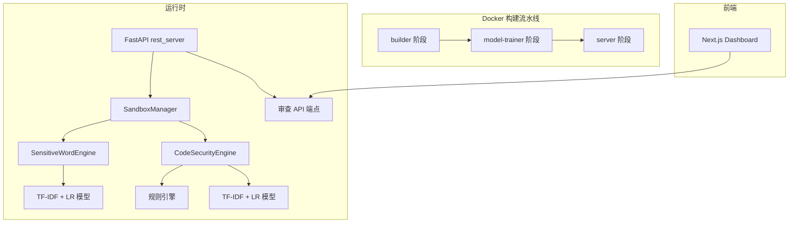

## 用户需求

为 AutoGPT 项目开发内置安全沙箱与伦理审查模块，实现敏感词拦截和代码安全检测两大核心功能。自训练一个基于 scikit-learn 的轻量级机器学习模型来驱动审查逻辑，替代对外部 AutoMod API 的依赖。

## 产品概述

在已有的 AutoGPT 安全体系中新增本地化、可自托管的内容审查层。模块包含：敏感词检测引擎、代码安全检测引擎、伦理审查编排器、FastAPI 审查端点和前端管理 Dashboard。前后端集成在同一个项目中，通过项目根目录 `docker-compose up` 单条命令一键启动全部服务（自训练模型 + 后端 + 前端），部署完全自动化。

## 核心功能

- **敏感词拦截**：基于 TF-IDF + Logistic Regression 的文本分类器，检测输入内容是否包含敏感/违规词汇，返回决策（通过/拦截/标记）和风险评分
- **代码安全检测**：结合模式匹配（危险命令、路径遍历、代码注入等）和 ML 分类器，对代码片段进行安全审查
- **伦理审查编排**：统一的审查管理器，协调多个引擎协同工作，支持批量审查和实时审查两种模式
- **审查 API 端点**：提供 RESTful API 供前端和内部服务调用，支持单条审查和批量审查
- **前端管理 Dashboard**：在现有平台中添加安全沙箱管理页面，展示审查统计、拦截日志、模型状态和配置面板
- **自动化模型训练**：训练数据集内置在代码中，Docker 构建阶段自动执行训练并生成 .pkl 模型文件

## 技术选型

| 层次 | 技术 | 说明 |
| --- | --- | --- |
| ML 框架 | scikit-learn | 轻量、无需 GPU、支持 .pkl 序列化，与已有模型文件兼容 |
| 特征提取 | TF-IDF (TfidfVectorizer) | 经典文本特征工程，配合中文分词（jieba） |
| 分类器 | Logistic Regression | 高效二分类，输出概率分数即风险评分，可解释性强 |
| 代码安全 | 正则模式匹配 + TF-IDF + LR | 双引擎：规则引擎快速拦截已知危险模式，ML 引擎检测可疑代码 |
| 后端 | Python 3.10+, FastAPI, Pydantic v2 | 与现有架构一致 |
| 前端 | Next.js 15.5, React 18, shadcn/ui, Tailwind CSS | 与现有前端技术栈一致 |
| 部署 | Docker Compose + 多阶段 Docker 构建 | 新增 model-trainer 构建阶段 |


## 实现方案

### 整体策略

在已有 `security_sandbox/` 骨架目录中填入完整实现，保持与现有 AutoGPT 架构的兼容性。核心思路是将模型训练嵌入 Docker 构建流水线——在 builder 阶段之后新增一个轻量级的 model-trainer 阶段，安装 scikit-learn + jieba + joblib，运行训练脚本输出 `.pkl` 文件，然后将模型文件复制到 server 阶段供运行时加载。

### 模型训练流水线

```
Docker Build:
  builder → model-trainer → server
                ↓
       train_all.py 执行:
       1. 加载内置数据集 (JSON)
       2. jieba 中文分词
       3. TfidfVectorizer 特征提取
       4. LogisticRegression 训练
       5. joblib.dump 输出 .pkl
       6. 输出模型元数据 (准确率等)
```

### 运行时审查流程

```
用户输入 → SandboxManager.review()
  ├── SensitiveWordEngine.predict(text)  → {decision, score, matched_words}
  ├── CodeSecurityEngine.predict(code)   → {decision, score, matched_patterns}
  └── EthicsReviewResult (汇总)           → {approved, risks[], summary}
```

### 与现有 AutoMod 的关系

内置沙箱作为 AutoMod 的本地化补充，不替代外部 API。在 `SandboxManager` 中同时支持内置引擎和 AutoMod 回退：优先使用内置模型，当内置模型置信度不足时回退到 AutoMod（如果配置了）。

### 性能考虑

- 模型在启动时一次性加载到内存（LR 模型 < 1MB，Vectorizer < 5MB），单次推理 < 5ms
- 规则引擎使用预编译正则，O(n) 扫描
- 支持批量审查接口，减少 API 调用开销
- Docker 构建时训练，避免运行时开销

## 实现细节

### Dockerfile 修改要点

在现有 `builder` 和 `server` 阶段之间插入 `model-trainer` 阶段：

- 基于 builder 的 `.venv` 安装 scikit-learn、jieba、joblib
- 运行 `python -m backend.security_sandbox.training.train_all`
- 输出模型到 `/app/autogpt_platform/backend/backend/security_sandbox/models/`
- server 阶段通过 `COPY --from=model-trainer` 获取生成的 .pkl 文件

### 依赖管理

在 `pyproject.toml` 的 `[tool.poetry.dependencies]` 中添加：

- `scikit-learn` (>=1.3.0)：机器学习框架
- `jieba` (>=0.42)：中文分词
- `joblib` (>=1.3.0)：模型序列化（scikit-learn 已依赖，显式声明）

### API 端点设计

所有端点在 `/api/sandbox` 前缀下注册到 rest_server：

- `POST /api/sandbox/review/text` — 单条文本审查
- `POST /api/sandbox/review/code` — 单条代码审查
- `POST /api/sandbox/review/batch` — 批量审查
- `GET /api/sandbox/models/status` — 模型状态与元数据
- `GET /api/sandbox/stats` — 审查统计

### 错误处理

- 模型加载失败时，引擎降级为纯规则模式（仅代码安全引擎适用）
- 所有审查异常被包装为 `SandboxError`，不阻断主流程
- 敏感词引擎不可用时返回 `fail_open=True` 策略（默认放行但标记）

## 架构设计

### 系统架构图



### 模块关系

- **SandboxManager**：总编排器，管理引擎生命周期、模型加载、审查分流
- **SensitiveWordEngine**：加载 sw_model.pkl，实现 `predict(text)` 接口
- **CodeSecurityEngine**：加载 cs_model.pkl + 规则集，实现 `predict(code)` 接口
- **训练模块**：独立于运行时，仅 Docker 构建阶段使用
- **API 路由模块**：FastAPI Router，注册到 rest_server

### 数据流

```
用户提交审查请求 → REST API → SandboxManager.review()
  → 并行调用 SensitiveWordEngine + CodeSecurityEngine
  → 汇总结果 → EthicsReviewResult
  → 存储审查日志 → 返回 JSON 响应
```

## 目录结构

> 注：不再新建根目录 docker-compose，直接修改 `autogpt_platform/` 下已有的 `docker-compose.yml` + `docker-compose.platform.yml`，在其中集成安全沙箱服务和 model-trainer 阶段。

```
d:/cn gpt/AutoGPT-master/
└── autogpt_platform/
    ├── docker-compose.yml                     # [MODIFY] 添加 security-sandbox 服务定义
    ├── docker-compose.platform.yml            # [MODIFY] 添加 security-sandbox 服务定义
    ├── backend/
    │   ├── Dockerfile                         # [MODIFY] 添加 model-trainer 构建阶段
    │   ├── pyproject.toml                     # [MODIFY] 添加 scikit-learn, jieba, joblib
    │   └── backend/
    │       ├── api/
    │       │   └── rest_api.py                # [MODIFY] 注册 security_sandbox 路由
    │       └── security_sandbox/
    │           ├── __init__.py                # [MODIFY] 模块导出
    │           ├── sandbox_manager.py         # [NEW] 审查编排器，管理引擎加载与审查流程
    │           ├── engines/
    │           │   ├── __init__.py            # [NEW] 引擎模块导出
    │           │   ├── sensitive_word_engine.py  # [NEW] 敏感词检测引擎
    │           │   └── code_security_engine.py   # [NEW] 代码安全检测引擎
    │           ├── models/
    │           │   ├── cs_model.pkl           # [EXISTING/MODIFY] 代码安全模型（训练后覆盖）
    │           │   ├── sw_model.pkl           # [EXISTING/MODIFY] 敏感词模型（训练后覆盖）
    │           │   └── model_metadata.json    # [NEW] 模型版本、准确率等元数据
    │           ├── training/
    │           │   ├── __init__.py            # [MODIFY]
    │           │   ├── dataset/
    │           │   │   ├── __init__.py        # [MODIFY]
    │           │   │   ├── sensitive_words_dataset.py  # [NEW] 敏感词训练数据集
    │           │   │   └── code_security_dataset.py    # [NEW] 代码安全训练数据集
    │           │   ├── train_sensitive_word.py  # [NEW] 敏感词模型训练脚本
    │           │   ├── train_code_security.py    # [NEW] 代码安全模型训练脚本
    │           │   └── train_all.py              # [NEW] 训练编排入口
    │           ├── routes/
    │           │   └── security_sandbox_api.py    # [NEW] FastAPI 审查端点路由
    │           └── tests/
    │               ├── __init__.py                # [EXISTING]
    │               ├── test_sensitive_word.py     # [NEW] 敏感词引擎单元测试
    │               └── test_code_security.py      # [NEW] 代码安全引擎单元测试
    └── frontend/
        └── src/
            └── app/
                └── (platform)/
                    └── security-sandbox/
                        └── page.tsx               # [NEW] 安全沙箱 Dashboard 页面
```

## 关键代码结构

### SandboxManager 核心接口

```python
class SandboxManager:
    """安全沙箱审查编排器 - 单例模式"""
    _sw_engine: SensitiveWordEngine | None
    _cs_engine: CodeSecurityEngine | None

    async def initialize(self) -> None: ...
    async def review_text(self, text: str, context: dict | None = None) -> EthicsReviewResult: ...
    async def review_code(self, code: str, language: str = "auto") -> EthicsReviewResult: ...
    async def review_batch(self, items: list[ReviewItem]) -> list[EthicsReviewResult]: ...
    def get_model_status(self) -> ModelStatus: ...

class EthicsReviewResult(BaseModel):
    approved: bool
    risks: list[RiskDetail]
    summary: str
    combined_score: float

class RiskDetail(BaseModel):
    engine: Literal["sensitive_word", "code_security"]
    decision: Literal["approved", "rejected", "flagged"]
    score: float
    reason: str
    matches: list[str]
```

### 引擎公共接口

```python
class BaseEngine(ABC):
    model: Any
    vectorizer: Any
    
    @abstractmethod
    def predict(self, content: str) -> EngineResult: ...
    
    @classmethod
    def load_model(cls, model_path: str) -> tuple[Any, Any]: ...

class EngineResult(BaseModel):
    decision: Literal["approved", "rejected", "flagged"]
    score: float
    matches: list[str]
    reason: str
```

## 设计风格

采用与现有 AutoGPT 平台一致的现代企业级设计风格，使用 shadcn/ui 组件体系确保视觉一致性。Dashboard 页面以深色侧边栏 + 浅色内容区的经典布局呈现，通过卡片网格展示审查统计指标，表格组件呈现审查日志列表。

## 页面设计（安全沙箱管理 Dashboard）

### 页面布局

- **顶部导航栏**：沿用现有平台导航，新增"安全沙箱"菜单项入口
- **统计概览区**：4 个指标卡片横向排列（今日审查数、拦截率、敏感词命中数、代码风险检出数），卡片带渐变色图标和数字跳动动画
- **实时测试区**：左侧文本/代码输入框 + 右侧审查结果面板，用户可输入文本或粘贴代码片段进行即时审查测试，结果面板显示通过/拦截状态、风险评分进度条、命中详情列表
- **审查日志表格**：分页表格展示历史审查记录，列包含时间、内容摘要、审查类型、决策结果、风险评分、命中的敏感词/危险模式，支持按类型和时间筛选
- **模型状态面板**：显示两个模型（敏感词、代码安全）的版本、准确率、最后训练时间、文件大小，以及引擎运行状态指示灯（绿色/黄色/红色）
- **配置面板**：可调整拦截阈值、启用/禁用特定引擎、配置 fail-open 策略

## 交互设计

- 测试区输入后自动触发审查（300ms 防抖），结果面板实时更新
- 被拦截的内容用红色边框和警示图标标注，通过的内容用绿色标记
- 日志表格行 hover 时高亮并展示完整命中详情 tooltip
- 模型状态异常时卡片边框变为警告色，顶部浮现全局 warning banner