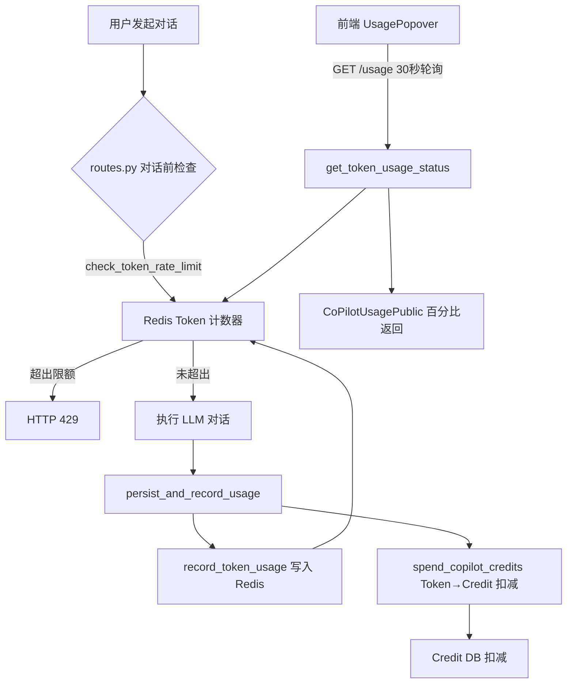

## 用户需求

将对话使用限制从当前的美元成本维度切换为 Token 维度，并实现基于 Token 消耗的 credit 扣费。

## 核心功能

1. **Token 每日限制**：每日对话上限为 1,000,000 Token，超出后阻止新对话
2. **Token 每周限制**：每周对话上限为 5,000,000 Token，超出后阻止新对话
3. **Token 基础 Credit 扣减**：每消耗 10,000 Token 扣除 0.01 credit（最小扣费 1 个系统单位）
4. **不新增前端组件**：复用现有 UsagePopover/UsageBar/UsageLimitReachedCard，后端改为 Token 维度后前端百分比 UI 自动适配

## 技术栈

- 后端：Python FastAPI + Redis（token 计数器）+ Pydantic Settings
- 前端：React + TypeScript（无需修改）
- 现有基础设施复用：`_incr_counter_atomic`、`_daily_key/_weekly_key` 模式、`UsageWindow`/`CoPilotUsagePublic` 模型

## 实现方案

### 核心策略：新增并行 Token 计数器维度

当前系统基于 **美元成本（microdollars）** 做限流，我们 **不删除** 现有美元计数器（保留向后兼容），而是新增一个并行的 **Token 计数器**（Redis 前缀 `copilot:token`），并在对话前检查 Token 维度的限流。

Credit 扣减方面，将 `spend_copilot_credits` 中当前基于 USD 的 credit 计算改为基于 Token 消耗计算。

### 架构设计



### 关键设计决策

1. **保留兼容性**：不删除现有 `copilot:cost` 计数器，新旧并存，防止回归
2. **复用现有模式**：Token 计数器完全复用 `rate_limit.py` 中 `_USAGE_KEY_PREFIX`→`_daily_key/_weekly_key`→`_incr_counter_atomic` 模式，仅前缀改为 `copilot:token`
3. **Credit 计算公式**：`token_credit = max(1, total_tokens // 10000)`，即将 Token 数除以 10000 作为扣费 credit 数（等于 `0.01 credit × (total_tokens / 10000)` 转换为系统单位）
4. **前端零修改**：`CoPilotUsagePublic.from_status()` 基于 `used/limit` 计算百分比，无论 used/limit 是美元还是 Token，百分比逻辑不变

## 目录结构

```
autogpt_platform/backend/
├── backend/
│   ├── util/
│   │   └── settings.py              # [MODIFY] Config 新增 credits_per_10000_tokens 字段
│   ├── copilot/
│   │   ├── config.py                # [MODIFY] ChatConfig 新增 daily_token_limit / weekly_token_limit
│   │   ├── rate_limit.py            # [MODIFY] 新增 Token Redis 计数器函数系列 + Token 限流 + Token 状态查询
│   │   └── token_tracking.py        # [MODIFY] persist_and_record_usage 新增 record_token_usage 调用;
│   │                                #          spend_copilot_credits 改为 Token 基础扣费
│   └── api/features/chat/
│       └── routes.py                # [MODIFY] 对话前检查改用 check_token_rate_limit;
│                                    #          /usage 端点改用 get_token_usage_status
└── .env                             # [FIX] 修正 ADMIN_ALLOWED_EMAILS 重复值
```

## 实现细节

### 1. settings.py — 新增配置字段

在 `Config` 类中 `credits_per_usd` 字段附近新增：

```python
credits_per_10000_tokens: float = Field(
    default=0.01,
    description="How many credits are deducted per 10,000 tokens consumed."
)
```

### 2. config.py — 新增 Token 限制配置

在 `ChatConfig` 类中 `weekly_cost_limit_microdollars` 之后新增：

```python
daily_token_limit: int = Field(
    default=1_000_000,
    ge=0,
    description="Max tokens per day, resets at midnight UTC. 0 = no limit (legacy USD-only).",
)
weekly_token_limit: int = Field(
    default=5_000_000,
    ge=0,
    description="Max tokens per week, resets Monday 00:00 UTC. 0 = no limit (legacy USD-only).",
)
```

### 3. rate_limit.py — Token 计数器核心

新增以下函数和模型（遵循现有 `_USAGE_KEY_PREFIX` → `_daily_key/_weekly_key` → `_incr_counter_atomic` 模式）：

**Key 前缀和生成器**：

```python
_TOKEN_KEY_PREFIX = "copilot:token"

def _daily_token_key(user_id: str, now: datetime | None = None) -> str:
    if now is None: now = datetime.now(UTC)
    return f"{_TOKEN_KEY_PREFIX}:daily:{user_id}:{now.strftime('%Y-%m-%d')}"

def _weekly_token_key(user_id: str, now: datetime | None = None) -> str:
    if now is None: now = datetime.now(UTC)
    year, week, _ = now.isocalendar()
    return f"{_TOKEN_KEY_PREFIX}:weekly:{user_id}:{year}-W{week:02d}"
```

**记录 Token 消耗**：

```python
async def record_token_usage(user_id: str, token_count: int) -> None:
    """记录 Token 消耗到 Redis 每日/每周计数器。fail-open 语义。"""
    if token_count <= 0: return
    now = datetime.now(UTC)
    d_key = _daily_token_key(user_id, now=now)
    w_key = _weekly_token_key(user_id, now=now)
    daily_ttl = max(int((_daily_reset_time(now=now) - now).total_seconds()), 1)
    weekly_ttl = max(int((_weekly_reset_time(now=now) - now).total_seconds()), 1)
    try:
        redis = await get_redis_async()
        await _incr_counter_atomic(redis, d_key, token_count, daily_ttl)
        await _incr_counter_atomic(redis, w_key, token_count, weekly_ttl)
    except (RedisError, RedisClusterException, ConnectionError, OSError):
        logger.warning("Redis unavailable for token usage recording")
```

**Token 限流检查**：

```python
async def check_token_rate_limit(user_id: str, daily_limit: int, weekly_limit: int) -> None:
    """检查 Token 每日/每周限制。0 表示限制未启用则跳过检查。"""
    if daily_limit <= 0 and weekly_limit <= 0:
        return  # Token limits not configured, skip
    now = datetime.now(UTC)
    try:
        redis = await get_redis_async()
        daily_raw, weekly_raw = await asyncio.gather(
            redis.get(_daily_token_key(user_id, now=now)),
            redis.get(_weekly_token_key(user_id, now=now)),
        )
        daily_used = int(daily_raw or 0)
        weekly_used = int(weekly_raw or 0)
    except (RedisError, RedisClusterException, ConnectionError, OSError) as exc:
        logger.warning("Token rate limit state unreadable: %s", exc)
        raise RateLimitUnavailable() from exc
    if daily_limit > 0 and daily_used >= daily_limit:
        raise RateLimitExceeded("daily", _daily_reset_time(now=now))
    if weekly_limit > 0 and weekly_used >= weekly_limit:
        raise RateLimitExceeded("weekly", _weekly_reset_time(now=now))
```

**Token 使用状态查询**（返回 `CoPilotUsageStatus`，前端通过 `from_status()` 转为百分比）：

```python
async def get_token_usage_status(user_id: str, daily_limit: int, weekly_limit: int, tier: SubscriptionTier = DEFAULT_TIER) -> CoPilotUsageStatus:
    now = datetime.now(UTC)
    daily_used = 0
    weekly_used = 0
    try:
        redis = await get_redis_async()
        daily_raw, weekly_raw = await asyncio.gather(
            redis.get(_daily_token_key(user_id, now=now)),
            redis.get(_weekly_token_key(user_id, now=now)),
        )
        daily_used = int(daily_raw or 0)
        weekly_used = int(weekly_raw or 0)
    except (RedisError, RedisClusterException, ConnectionError, OSError):
        logger.warning("Redis unavailable for token usage status")
    return CoPilotUsageStatus(
        daily=UsageWindow(used=daily_used, limit=daily_limit, resets_at=_daily_reset_time(now=now)),
        weekly=UsageWindow(used=weekly_used, limit=weekly_limit, resets_at=_weekly_reset_time(now=now)),
        tier=tier,
    )
```

### 4. token_tracking.py — 记录 Token + Token 基础 Credit 扣减

**persist_and_record_usage 修改**：
在 `record_cost_usage()` 调用后（第376行之后），新增 `record_token_usage()` 调用：

```python
# 新增：记录 Token 消耗到 Redis（Token 维度的每日/每周限流）
if user_id and total_tokens > 0:
    await record_token_usage(
        user_id=user_id,
        token_count=total_tokens,
    )
```

**spend_copilot_credits 修改**：
将信用扣减计算从 USD 基础改为 Token 基础：

```python
settings = Settings()
# Token-based credit cost: every 10000 tokens = 0.01 credit
# Convert to system units: 0.01 * 100(cents_per_credit) / 10000 = 0.0001 per token
# Simplified: credit_cost = max(1, total_tokens // 10000)
if total_tokens > 0:
    credit_cost = max(1, int(total_tokens / 10000 * settings.config.credits_per_10000_tokens * 100))
else:
    credit_cost = 1  # minimum 1 unit per turn
```

### 5. routes.py — 对话检查 + /usage 端点

**对话前限流检查**（第1091-1114行）：
从美元基础改为 Token 基础：

```python
if user_id:
    try:
        await check_token_rate_limit(
            user_id=user_id,
            daily_limit=config.daily_token_limit,
            weekly_limit=config.weekly_token_limit,
        )
    except RateLimitExceeded as e:
        raise HTTPException(status_code=429, detail=str(e)) from e
    except RateLimitUnavailable as e:
        raise HTTPException(status_code=503, ...)
```

**GET /usage 端点**（第666-691行）：

```python
async def get_copilot_usage(user_id: ...) -> CoPilotUsagePublic:
    tier = await get_user_tier(user_id)
    status = await get_token_usage_status(
        user_id=user_id,
        daily_limit=config.daily_token_limit,
        weekly_limit=config.weekly_token_limit,
        tier=tier,
    )
    return CoPilotUsagePublic.from_status(status)
```

### 6. .env 修正

修复第64行 `ADMIN_ALLOWED_EMAILS` 的重复值：`z94073898@gmail.comz94073898@gmail.com` → `z94073898@gmail.com`。

## 性能与可靠性

- **Redis 操作复杂度**：O(1) GET/INCRBY，与现有美元计数器相同
- **故障模式**：Token 计数器采用 fail-open 语义（Redis 不可用时静默跳过记录），限流检查采用 fail-closed 语义（Redis 不可用时抛 `RateLimitUnavailable(503)`），与现有美元计数器保持一致
- **内存占用**：每个用户每天/每周产生 2 个 Redis key（daily + weekly），均带 TTL 自动过期，与美元计数器相同
- **并发安全**：`_incr_counter_atomic` 使用 Redis MULTI/EXEC 事务，与现有模式一致